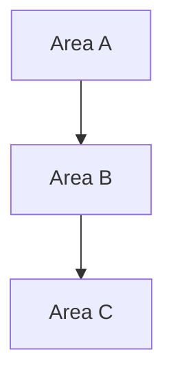

1. Warn user: "This command scans and analyzes your entire codebase file by file. It may consume a significant amount of tokens." Ask to confirm before continuing. If user declines → STOP.
2. Check `CLAUDE.md` exists. If missing → tell user to run `/init` first, STOP.
3. Read `.claude/s/skills.md` and `.claude/s/mapper.json` if they exist, for context.
4. Scan the project source code. Browse file by file, understand what each file does and how files connect.
5. Group related files into logical areas (e.g. authentication, database, routing, UI components, state management, API layer, config, etc.). Each group should represent one complete feature or concern.
6. Create `.claude/docs/structures/` folder. Write one `.md` file per logical area. Use this format:

```markdown
# [Area Name]

## Purpose
One sentence: what this area does.

## Files
- `path/to/file.ts` — what it does
- `path/to/other.ts` — what it does

## How It Works
Plain English walkthrough of the flow. Use numbered steps for sequences.
Keep it simple — a new developer should understand it in under 2 minutes.

## Key Functions
- `functionName()` in `file.ts` — what it does
- `anotherFn()` in `other.ts` — what it does

## Diagram
Include a Mermaid diagram showing how files/components in this area connect and interact.
Keep it small — under 15 nodes. Use the best type for the area: `flowchart` for sequences, `graph` for dependencies, `classDiagram` for data models.

## Depends On
- [Other Area Name] — why
```

7. Create `.claude/docs/structures/README.md`. Include an overview Mermaid diagram showing how all areas relate to each other:

```markdown
# Project Structure Docs

Auto-generated by `/s:structure`. Each file documents one logical area of the project.

## Overview


## Areas
- **[area-name].md** — one-line description

Re-run `/s:structure` to regenerate.
```

8. Show summary: list of areas found, file count per area, and path to docs.

**Rules:**
- Write for humans, not machines. Short sentences. No jargon unless necessary.
- Skip generated files, node_modules, build output, lock files, and config-only files.
- If the project is large, focus on the most important areas first and note any skipped sections.
- Do NOT modify any source code.
